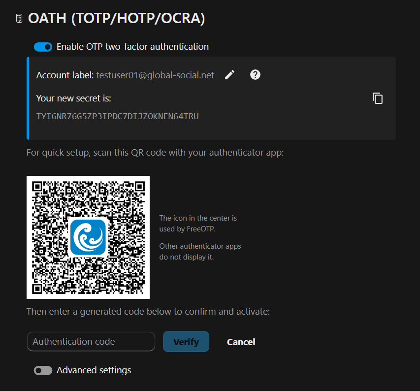
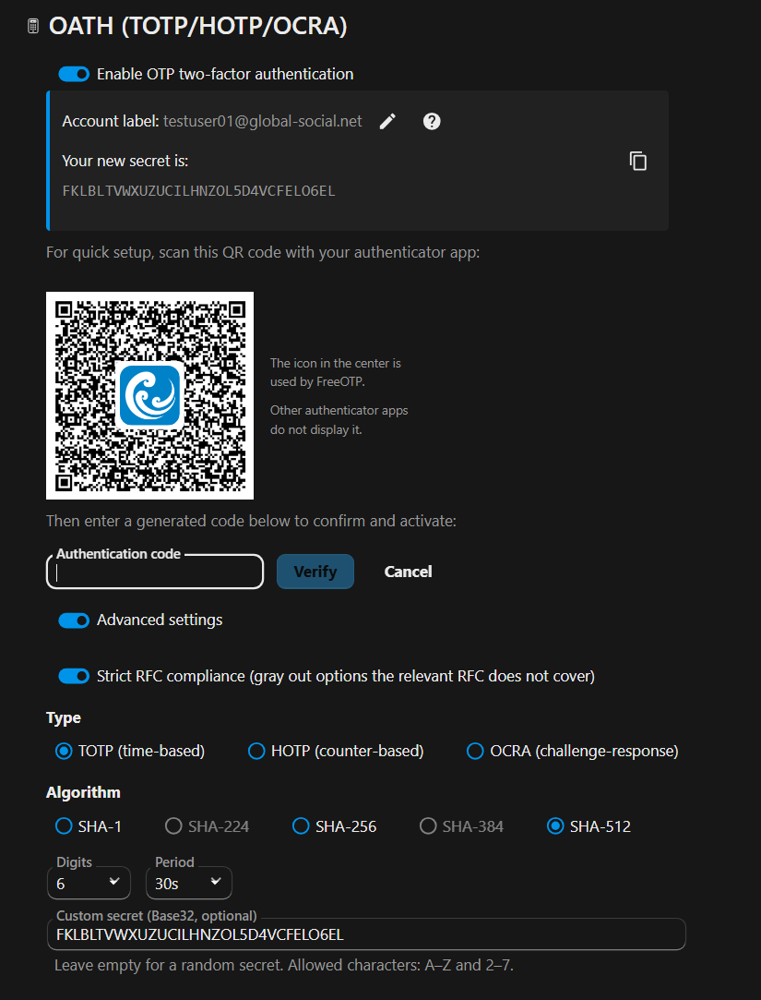
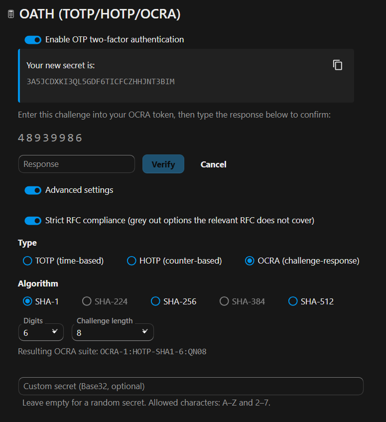
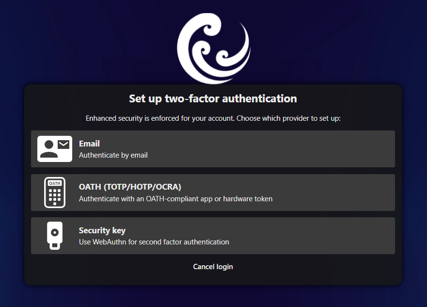
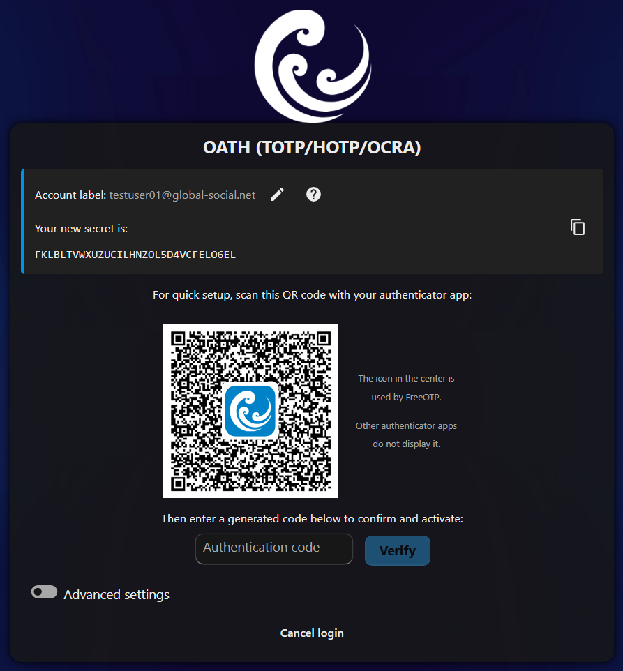
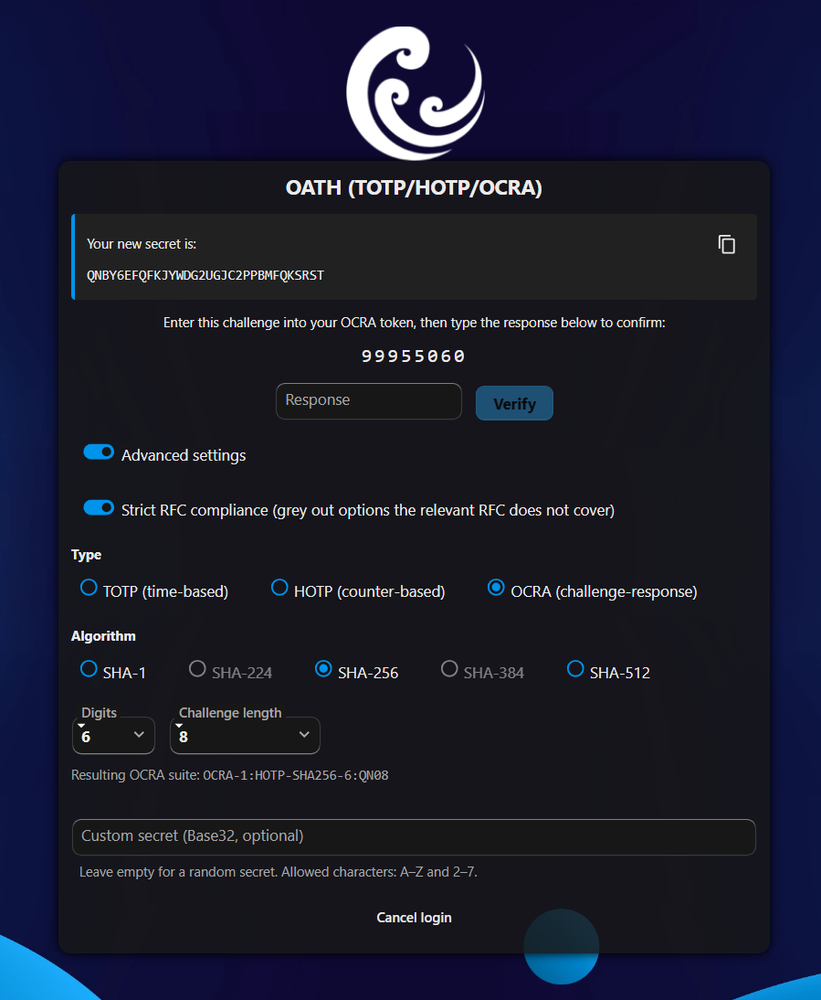
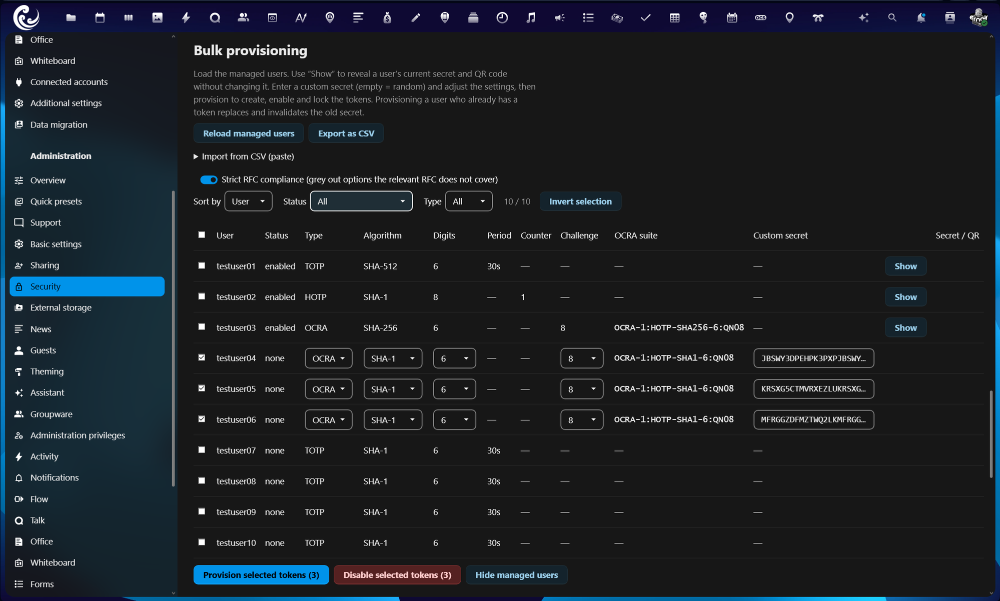
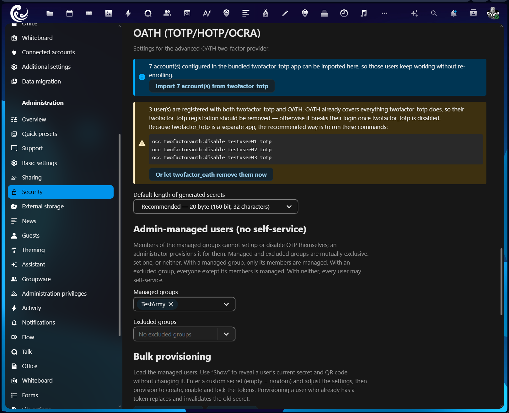

<!--
  SPDX-FileCopyrightText: 2026 [ernolf] Raphael Gradenwitz <raphael.gradenwitz@googlemail.com>
  SPDX-License-Identifier: AGPL-3.0-or-later
-->

# Two-Factor OATH (TOTP / HOTP / OCRA)

[](https://api.reuse.software/info/github.com/ernolf/twofactor_oath)
[](https://apps.nextcloud.com/apps/twofactor_oath)
[](https://github.com/ernolf/twofactor_oath/releases/latest)
[](https://explore.transifex.com/nextcloud/nextcloud/)
[](https://github.com/ernolf/ncmake)

> Advanced, fully open OATH one-time-password provider for Nextcloud: time-based (TOTP), counter-based (HOTP) and challenge-response (OCRA) tokens, configurable per token, with encrypted secrets, admin-managed bulk provisioning and a seamless import from the bundled `twofactor_totp` app.

<p align="center"></p>

`twofactor_oath` is a second-factor provider for the Nextcloud login. It is built for everything the bundled `twofactor_totp` cannot do: hardware OATH tokens, configurable algorithm and length, predetermined (custom) secrets, challenge-response, admin enrollment for whole groups, and mass provisioning. The simple cases stay simple, the advanced cases become possible.

## What is OATH?

OATH (the [Initiative for Open Authentication](https://openauthentication.org)) is the family of open one-time-password standards. This app implements all three:

| Standard | RFC | Mechanism | In this app |
| --- | --- | --- | :-: |
| HOTP | [RFC 4226](https://www.rfc-editor.org/info/rfc4226/) | Counter-based one-time password | yes |
| TOTP | [RFC 6238](https://www.rfc-editor.org/info/rfc6238/) | Time-based one-time password | yes |
| OCRA | [RFC 6287](https://www.rfc-editor.org/info/rfc6287/) | Challenge-response | yes |

The full specifications are listed at [openauthentication.org/specifications](https://www.openauthentication.org/specifications.html).

OATH is not the same as FIDO2/WebAuthn. OATH uses a shared secret and a code you read and type; FIDO2 uses public-key cryptography bound to the website. See [doc/compatibility.md](doc/compatibility.md) for the difference and when to use which.

## Features

- **All three OATH algorithms**: TOTP, HOTP and OCRA, selectable per token.
- **Configurable per token**: hash algorithm (SHA-1 / 224 / 256 / 384 / 512), number of digits (4 to 10), TOTP period or HOTP counter, OCRA suite and challenge length.
- **Custom or random secrets**: enter a predetermined Base32 secret (for hardware seeds) or let the app generate one. Length is chosen from clear strength presets (128 to 640 bit) and is always a whole number of bytes, so the QR code imports into every authenticator.
- **Encrypted at rest**: secrets are stored encrypted with the Nextcloud instance key, the same mechanism the bundled `twofactor_totp` uses.
- **Strict RFC mode**: an optional switch that greys out anything the relevant RFC does not cover, so an admin gets safe, interoperable defaults without losing the freedom to deviate.
- **Issuer icon in the QR code**: the instance favicon is embedded via the `otpauth://` `image=` parameter, shown by authenticators that support it (for example FreeOTP).
- **Readable, editable account label**: the account name carried in the QR code (what an authenticator app shows for the token) is prefilled and can be edited before scanning. When the user ID is opaque, such as a guests-app hash or an LDAP UUID, the email is used so the label stays readable instead of a hash. The label goes only into the QR code and is not stored on the server.
- **HOTP resynchronisation**: a drifted counter recovers with two consecutive codes ([RFC 4226 section 7.4](https://www.rfc-editor.org/info/rfc4226/#section-7.4)), both at the login prompt and in the personal settings, so users never get locked out.
- **Admin enrollment**: define managed groups whose members cannot self-service; provision, enable and lock their tokens for them.
- **Bulk provisioning**: an inline table with sorting and filtering, per-row editing, custom secrets, live validation, QR and secret reveal, and a replace guard.
- **CSV export and paste import**, plus a one-click **import from `twofactor_totp`** so existing users switch over without being locked out.
- **Software OCRA token** for testing: [`tools/ocra_device`](tools/ocra_device), verified against the [RFC 6287 test vectors](https://www.rfc-editor.org/info/rfc6287/#appendix-C).

## Screenshots

**Choosing the second factor at login**


**Personal setup with QR code**



**Advanced settings (type, algorithm, digits, period, strict mode)**



**OCRA challenge-response setup**



**Setting up at login (enforced two-factor)**

When two-factor authentication is enforced, a user without a token sets one up during login: pick the provider, then enroll (TOTP by default, or any type under Advanced settings).







**Admin bulk provisioning**



**Seamless import from twofactor_totp**



## Quickstart

### For users

1. Open **Settings → Security**, find **OATH (TOTP/HOTP/OCRA)** and turn it on.
2. Optionally edit the **account label** shown next to the secret; it only changes the name your authenticator app displays.
3. Scan the QR code with your authenticator app, or copy the secret.
4. Enter a generated code to confirm and activate.
5. Use **Show configuration** at any time to review your settings, or reveal the secret and QR again (protected by your password).

Need advanced options, HOTP or OCRA? Open **Advanced settings** during setup. See [doc/ocra.md](doc/ocra.md) for challenge-response.

### For administrators

1. Open **Administration → Security → OATH (TOTP/HOTP/OCRA)**.
2. Optionally set the default secret length and define **managed groups** (members are admin-provisioned and cannot self-service).
3. Under **Bulk provisioning**, load the managed users, set their tokens (or paste a CSV), and provision the selected rows.
4. Migrating from `twofactor_totp`? With both apps enabled, click **Import accounts**, then disable `twofactor_totp`.

Details: [doc/admin-guide.md](doc/admin-guide.md).

## Comparison to twofactor_totp

`twofactor_totp` ships with Nextcloud and covers simple self-service TOTP. `twofactor_oath` is the advanced alternative and can run alongside it. For a clean setup the recommended path is to import the existing accounts (only offered while `twofactor_totp` is enabled) and then disable `twofactor_totp`. Because both apps store secrets the same way, the import is lossless and users keep working without re-enrolling.

| | twofactor_oath | twofactor_totp |
| --- | :-: | :-: |
| TOTP | yes | yes |
| HOTP | yes | no |
| OCRA (challenge-response) | yes | no |
| Per-token algorithm / digits / period | yes | algorithm only, instance-wide |
| Custom (predetermined) secret | yes | no |
| Admin-managed enrollment and lock | yes | no |
| Bulk provisioning, CSV, import | yes | no |
| Readable, editable account label | yes | no |
| Re-display an existing secret and QR | yes (password-confirmed, 60 s auto-hide) | no |
| Password required to disable | yes (see [security](doc/security.md)) | no |

## Security

Secrets are encrypted at rest, revealing a secret or disabling the provider always requires a fresh password confirmation, and TOTP/HOTP replay is mitigated. See [doc/security.md](doc/security.md) for the full model.

## Installation

The app is published in the [App Store](https://apps.nextcloud.com/apps/twofactor_oath). It can be [installed through Nextcloud's app management UI](https://docs.nextcloud.com/server/latest/admin_manual/apps_management.html#managing-apps) or with `occ app:enable twofactor_oath`.

A release tarball and a from-source build are available too:

### From a release tarball

Download the latest release tarball from the [releases page](https://github.com/ernolf/twofactor_oath/releases) and extract it into your Nextcloud `apps/` directory, so the app lives at `apps/twofactor_oath/`. Then set ownership to your web server user and enable it:

```sh
tar -xzf twofactor_oath-x.y.z.tar.gz -C /path/to/nextcloud/apps/
chown -R www-data:www-data /path/to/nextcloud/apps/twofactor_oath
occ app:enable twofactor_oath
```

### From source

The build is driven by [ncmake](https://github.com/ernolf/ncmake) and runs entirely in throwaway containers, so the only requirement is **[podman](https://podman.io/)** (or Docker) — no PHP or Node toolchain on the host. The first `make` fetches the shared ncmake Makefile once into `~/.cache/ncmake/`. Clone and build the tarball:

```sh
git clone https://github.com/ernolf/twofactor_oath.git
cd twofactor_oath
make build && make dist
```

This writes `build/artifacts/dist/twofactor_oath-x.y.z.tar.gz`. Install it exactly like a release tarball above (extract into `apps/`, set ownership, then `occ app:enable twofactor_oath`).

If your Nextcloud is on the same machine (or reachable over SSH), you can skip the tarball and rsync the runtime files straight into its `apps/` directory:

```sh
make build && make rsync TARGET=/path/to/nextcloud/apps/
chown -R www-data:www-data /path/to/nextcloud/apps/twofactor_oath
occ app:enable twofactor_oath
```

`TARGET` is the `apps/` parent directory and may be a local path or a remote `user@host:` path.

Working on the app itself? See [doc/development.md](doc/development.md) for the quality gates and the [ncmake README](https://github.com/ernolf/ncmake#readme) for all `make` targets.

## Documentation

- [doc/index.md](doc/index.md): documentation hub
- [doc/admin-guide.md](doc/admin-guide.md): administration and provisioning
- [doc/ocra.md](doc/ocra.md): OCRA challenge-response and the software test token
- [doc/security.md](doc/security.md): security model
- [doc/compatibility.md](doc/compatibility.md): client and hardware compatibility, OATH vs FIDO
- [doc/design.md](doc/design.md): architecture and specification
- [doc/development.md](doc/development.md): development, quality gates and deploying to a test instance

## License

[AGPL-3.0-or-later](LICENSES/AGPL-3.0-or-later.txt). Author: [ernolf] Raphael Gradenwitz.

