<!--
  SPDX-FileCopyrightText: 2026 [ernolf] Raphael Gradenwitz <raphael.gradenwitz@googlemail.com>
  SPDX-License-Identifier: AGPL-3.0-or-later
-->

# Administration guide

All settings live under **Administration → Security → OATH (TOTP/HOTP/OCRA)**.

## Default secret length

New random secrets are generated at the length chosen here. The length is the amount of key material in bytes, shown together with its bit strength and Base32 character count:

| Preset | Key material | Strength | Base32 characters |
| --- | --- | --- | --- |
| Minimal | 16 byte | 128 bit (the [RFC 4226 minimum](https://www.rfc-editor.org/info/rfc4226/#section-4)) | 26 |
| Recommended | 20 byte | 160 bit (the [RFC 4226 recommendation](https://www.rfc-editor.org/info/rfc4226/#section-4)) | 32 |
| High | 40 byte | 320 bit | 64 |
| Extreme | 60 byte | 480 bit | 96 |
| Paranoia | 80 byte | 640 bit | 128 |

Only these presets can be selected, so a generated secret always decodes to a whole number of bytes and imports into every authenticator. A Base32 string with an arbitrary character count can end on a partial byte that no authenticator can decode; this is a property of Base32 itself, not a quirk of any app. See [Base32 and secret length](security.md#base32-and-secret-length) for the details.

## Managed and excluded groups

Members of a **managed group** cannot set up or disable OATH themselves; an administrator provisions and locks their token. Managed groups and excluded groups are mutually exclusive: you set one of them, or neither. The UI enforces this by disabling one selector while the other has entries.

- Set a **managed group**: only its members are managed, everyone else self-services.
- Set an **excluded group**: everyone except its members is managed.
- Set **neither**: every user may self-service.

Managed users see a note pointing them to their administrator instead of the self-service controls.

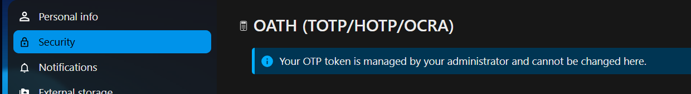

## Bulk provisioning


1. **Load managed users** to populate the table with every managed user and their current status.
2. Tick the rows you want to (re)provision. Rows are editable only while ticked; untouched rows are shown read-only.
3. Set type, algorithm, digits and so on per row. The **Strict RFC compliance** switch greys out non-RFC options (it only affects what you can pick in the UI, not what is stored).
4. Optionally enter a custom Base32 secret per row (empty means a random secret). Invalid characters or lengths are flagged inline.
5. **Provision selected tokens** creates, enables and locks the chosen tokens. A row that already has a token triggers a replace warning, because provisioning invalidates the old secret.

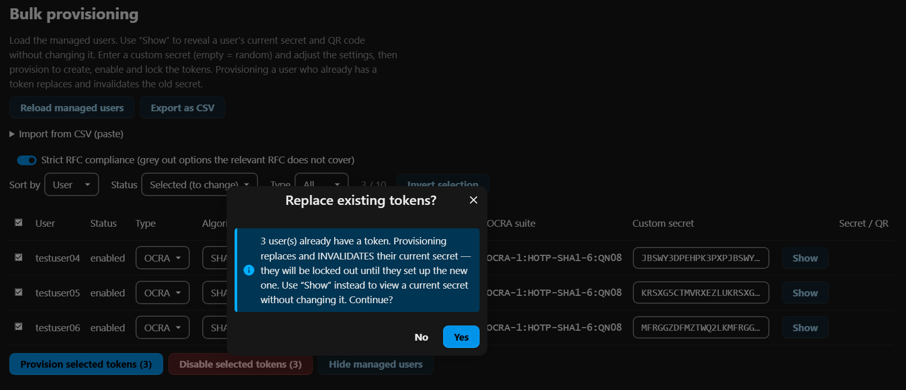

This guard prevents accidental lockouts: replacing a token invalidates the old secret, so the dialog points to **Show** for the common case of only wanting to view an existing secret.

Use the **Show** button on a row to reveal its current secret and QR code without changing it; **Hide** puts it away again.

**Disable selected tokens** removes OATH for the ticked users: each secret is deleted and the provider registration removed (the same as `occ twofactorauth:disable <uid> oath`). It asks for confirmation first, because it cannot be undone.

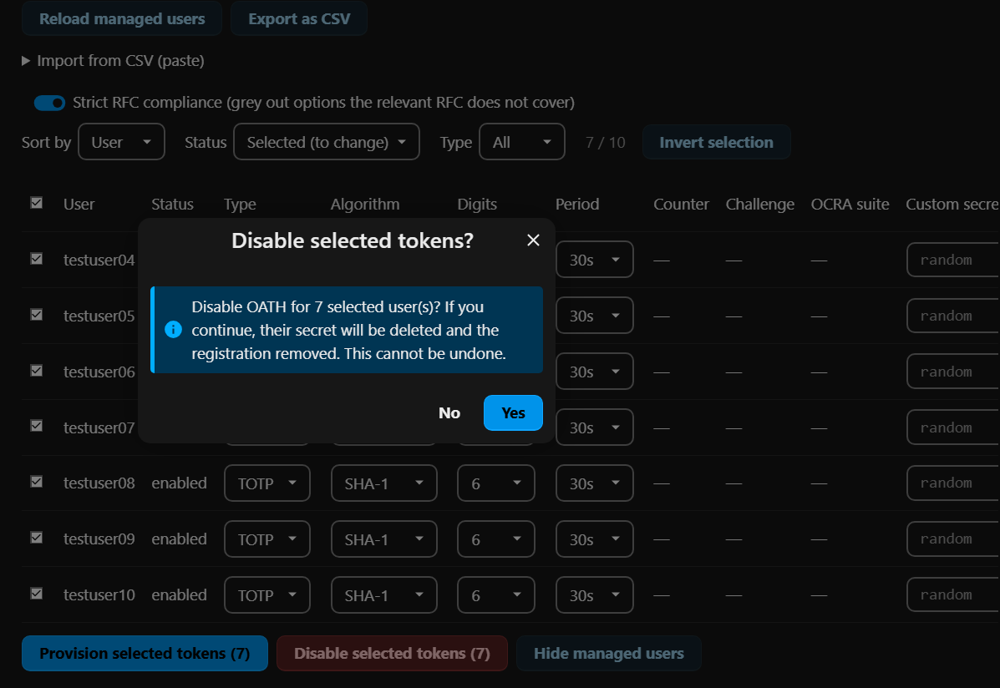

### Sorting and filtering

The toolbar above the table sorts by user, status or type, and filters by status and by type. The full list always stays loaded; sorting and filtering only change what is displayed. This is what makes a list of a few hundred users manageable: provision a handful, then filter to review exactly those.

The **Invert selection** button flips the ticked state of every visible row, which is the fast path on large lists: filter to a subset and invert, or tick a few and invert to select all the others. With a filter active it only affects the rows currently shown.

To select a contiguous range, tick one row, then **Shift+click** another: every row between the two is set to the clicked row's state.

The status filter offers **All**, **Selected (to change)** (the rows you are about to provision), **Without token** (status `none`), **Enabled**, and **Provisioned**.

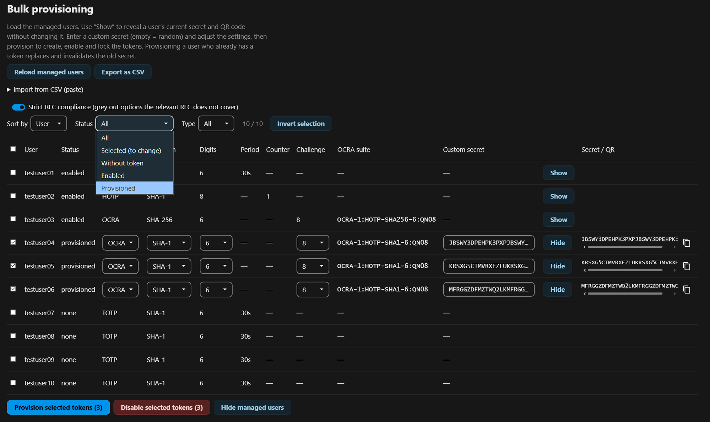

A freshly provisioned token shows as **provisioned**, not yet **enabled**, until you reload the list with **Reload managed users**. This is deliberate: right after a bulk action you can filter to **Provisioned** to review exactly what you just created, separate from tokens that were already enabled before. After reloading the list they join the **enabled** set.

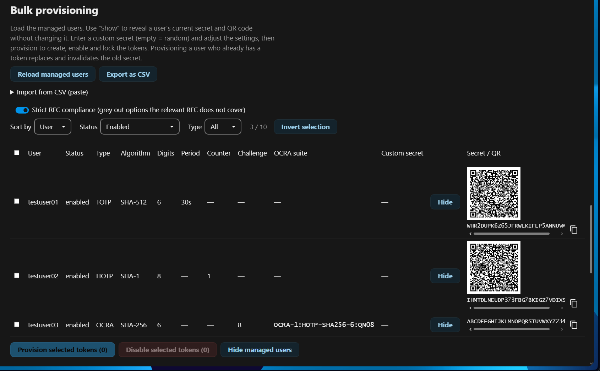

## CSV export and paste import

> [!NOTE]
> Most installations never need this. The interactive table above already covers bulk provisioning with live validation. CSV is for preparing or editing large lists outside the browser.

**Export as CSV** downloads the current list. Exporting the accounts from the screenshots above produces the following (trimmed here to one row per type plus one unconfigured user):

```csv
username,status,type,algorithm,digits,period,counter,challenge,suite,secret
testuser01,enabled,totp,sha512,6,30,,,,
testuser02,enabled,hotp,sha1,8,,0,,,
testuser03,enabled,ocra,sha256,6,,,8,OCRA-1:HOTP-SHA256-6:QN08,
testuser04,none,totp,sha1,6,30,,,,
```

Each type fills only the columns that apply: TOTP has `period`, HOTP has `counter`, OCRA has `challenge` (the challenge length) and `suite`; the columns that do not apply stay empty. By default the `secret` column is empty on export; fill it in only to set a predetermined secret.

After clicking **Export as CSV** a dialog asks whether to include the existing secrets (default: no). Choosing yes fills the `secret` column with each enabled token's current secret, which turns the CSV into a portable backup that re-provisions the exact same tokens, including on another server, by pasting it back in. When restoring, set the `status` column to `renew` (or `none` for users without a token), otherwise the paste import leaves the `enabled` rows untouched (see the status table below).

> [!CAUTION]
> An export with secrets contains the tokens in plaintext — anyone holding the file can clone them. Store it securely and delete it when no longer needed.

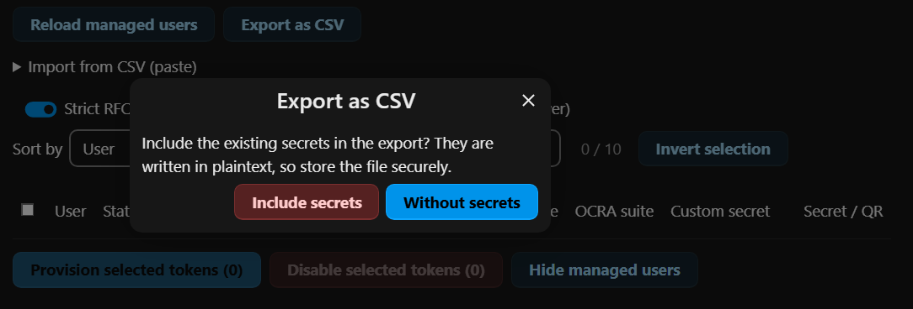

To import, paste rows into **Import from CSV (paste)** and click **Apply pasted CSV**. The paste merges into the loaded list; it does not replace it. The **status** column decides what happens to each listed user:

| Status in the CSV | Effect |
| --- | --- |
| `none` | ticked, values applied (provision a new token) |
| `renew` | ticked, values applied (replace an existing token; overrides the enabled lock) |
| `enabled` | left untouched (shown for context only) |
| `disabled` | left untouched |
| anything else or empty | left untouched |

Users not listed in the CSV are unticked and unchanged. After applying, the filter switches to **Selected** so you can review exactly the rows that will change, then **Provision selected tokens** as usual. The `suite` column is informational; the OCRA suite is recomputed from algorithm, digits and challenge length.

### Pre-seeding secrets at scale

The `secret` column is what makes CSV worth it for a larger rollout. Leave it empty for a random secret, or fill it with a predetermined Base32 seed, for example the seed already programmed into each user's hardware token. An IT department can prepare the whole list outside the browser, and the file is straightforward to generate from a script. Set `status` to `none` to provision a new token (or `renew` to replace an existing one), paste the rows, and provision the selected users in one pass.

For example, rolling out hardware OCRA tokens in the default suite, each with its known seed:

```csv
username,status,type,algorithm,digits,period,counter,challenge,suite,secret
testuser04,none,ocra,sha1,6,,,8,,JBSWY3DPEHPK3PXPJBSWY3DPEHPK3PXP
testuser05,none,ocra,sha1,6,,,8,,KRSXG5CTMVRXEZLUKRSXG5CTMVRXEZLU
testuser06,none,ocra,sha1,6,,,8,,MFRGGZDFMZTWQ2LKMFRGGZDFMZTWQ2LK
```

Each secret has to be a whole-byte Base32 string (these are 32 characters, i.e. 20 bytes / 160 bit). An invalid length is flagged on paste; see [Base32 and secret length](security.md#base32-and-secret-length).

Pasting these rows walks through three steps: the rows land in the paste box; **Apply pasted CSV** checks them, fills in the OCRA settings and recomputes the suite (the filter switches to **Selected**); and **Provision selected tokens** writes the tokens, after which **Show** reveals each stored secret.

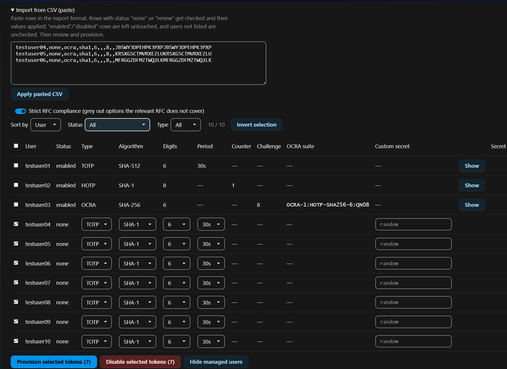

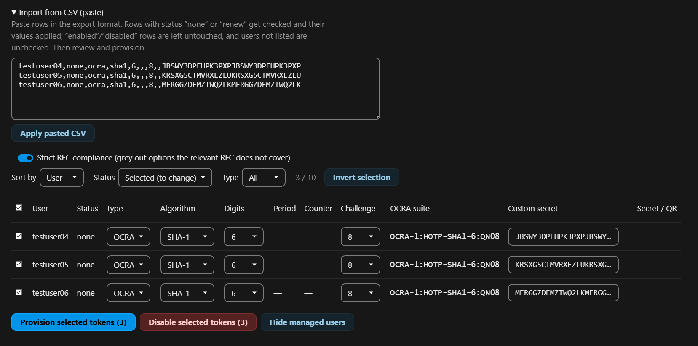

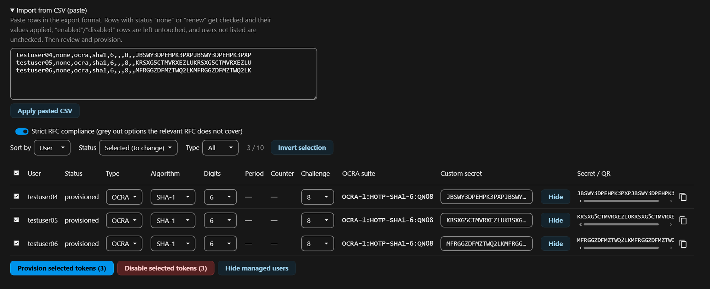

> [!TIP]
> Try the round-trip with two or three test accounts first: export, edit a row (set `renew` and a secret), paste it back, and watch how it lands in the table. Once that is clear, a mass import is straightforward.

## Importing from twofactor_totp


While the bundled `twofactor_totp` app is **enabled** and has accounts that are not yet set up in OATH, a banner offers to import them. Because both apps store secrets the same way, the import is lossless: each account becomes an enabled OATH TOTP token with the same secret, so the user keeps getting the same codes and is never locked out. Accounts whose user already has an OATH token are not offered, and existing OATH tokens are never overwritten.

As part of the import, each migrated user is switched off `twofactor_totp`: its secret for that user is removed and the provider is deregistered for them (Nextcloud tracks the configured second factor in the provider registry, not in the secret, so removing the secret alone would not be enough). This is why disabling `twofactor_totp` afterwards causes no "could not load" errors for imported users.

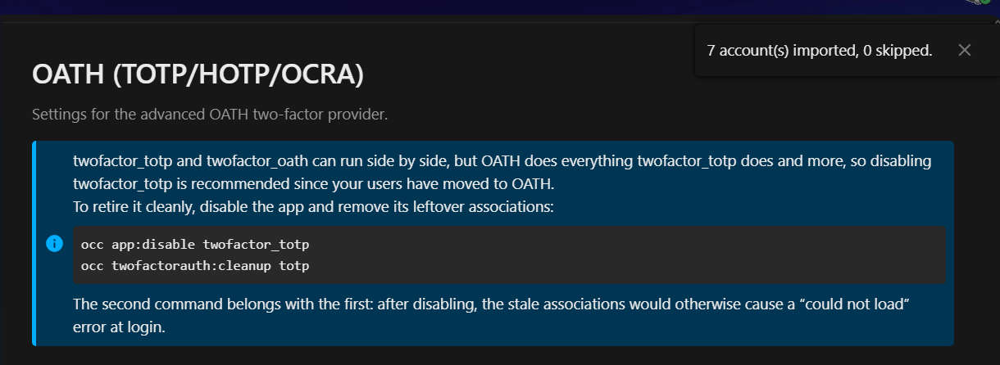

Import is only available while `twofactor_totp` is enabled, so both apps have to be active at the same time for the migration. The two apps can run side by side, but OATH does everything `twofactor_totp` does and more, so the recommended path is to import every account and then retire `twofactor_totp`:

```sh
occ app:disable twofactor_totp
occ twofactorauth:cleanup totp
```

The second command belongs with the first: after disabling, the stale provider associations remain and would otherwise cause a "could not load" error at login; `twofactorauth:cleanup` removes them. (`cleanup` only removes the associations, not secrets — but the import already deleted the `twofactor_totp` secret of every account it migrated.)

The import reads the source `algorithm` column when present (twofactor_totp 17.1.0 and newer); older versions are SHA-1, 6 digits, 30 seconds.

### Users registered with both apps

A user who set up OATH on their own (for example an administrator testing the app) and still has a `twofactor_totp` account is registered with **both** providers. Such a user is not offered for import (they already have OATH), so the import never cleans up their `twofactor_totp` registration, and disabling `twofactor_totp` would break their login. When this happens, a banner lists how many users are affected.

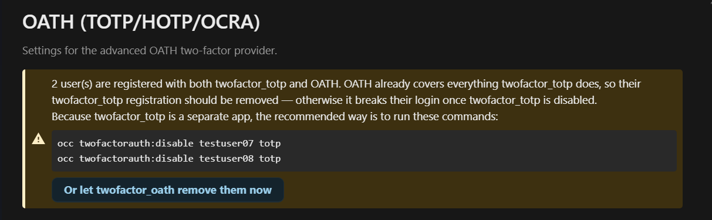

Because `twofactor_totp` is a separate app, the default is to show you the commands to run yourself, one per user:

```sh
occ twofactorauth:disable <uid> totp
```

Alternatively, confirm the banner's **let twofactor_oath remove them now** button to have this app perform the same operation (deregister the provider and delete the `twofactor_totp` secret) for those users. Because this deletes data of a separate app, it asks for confirmation first:

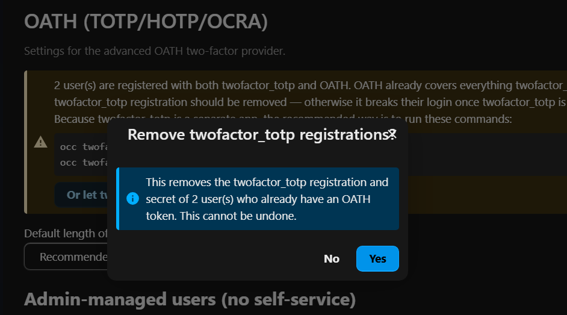

Either way nothing is left behind, so `twofactor_totp` can then be disabled cleanly.
