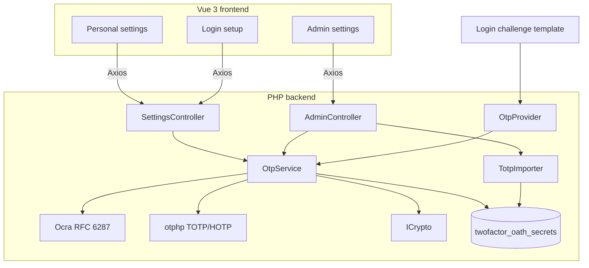
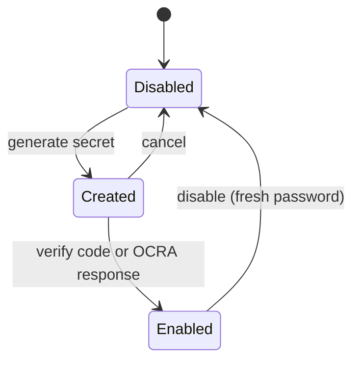

<!--
  SPDX-FileCopyrightText: 2026 [ernolf] Raphael Gradenwitz <raphael.gradenwitz@googlemail.com>
  SPDX-License-Identifier: AGPL-3.0-or-later
-->

# Design and specification

> Advanced OATH (TOTP / HOTP / OCRA) second-factor provider for Nextcloud. Author: [ernolf] Raphael Gradenwitz. License: AGPL-3.0-or-later.

## 1. Purpose and positioning

`twofactor_oath` is a self-contained OATH one-time-password provider for Nextcloud. It implements TOTP ([RFC 6238](https://www.rfc-editor.org/info/rfc6238/)), HOTP ([RFC 4226](https://www.rfc-editor.org/info/rfc4226/)) and OCRA ([RFC 6287](https://www.rfc-editor.org/info/rfc6287/)), with per-token hash algorithm, length, period or counter, OCRA suite, and an optional predetermined secret. Tokens can be admin-managed and locked, provisioned in bulk, and imported from the bundled `twofactor_totp`. It targets hardware OATH tokens and elevated requirements, while `twofactor_totp` remains the simple self-service TOTP option.

## 2. Comparison with other Nextcloud second factor providers

| App | Second factor | TOTP | HOTP | OCRA | Per-token algorithm / digits / period | Custom secret | Admin lock and bulk | OTP library |
| --- | --- | :-: | :-: | :-: | :-: | :-: | :-: | --- |
| **twofactor_oath** (this app) | OATH OTP (app or hardware) | yes | yes | yes | yes | yes | yes | spomky-labs/otphp plus own OCRA |
| twofactor_totp (bundled) | TOTP (app) | yes | no | no | algorithm only, instance-wide | no | no | rullzer/easytotp |
| twofactor_webauthn | WebAuthn / FIDO2 | n/a | n/a | n/a | n/a | n/a | partial | n/a |
| twofactor_gateway | SMS / Telegram / Signal | n/a | n/a | n/a | n/a | n/a | no | n/a |
| twofactor_nextcloud_notification | Push approval | n/a | n/a | n/a | n/a | n/a | no | n/a |
| twofactor_backupcodes (core) | One-time backup codes | n/a | n/a | n/a | n/a | n/a | no | n/a |

Two further differences are not in the table: this app requires a fresh password to disable the provider, and it can re-display an existing secret and QR under a forced password with a 60-second auto-hide. See [security.md](security.md).

A command-line provisioning command (`occ`) is intentionally not shipped: the bulk table and CSV paste import cover the interactive cases with live validation, and a headless command would add value only for scripted mass provisioning. It can be added later without schema changes.

## 3. Architecture

- **Backend:** PHP 8.1+, Nextcloud 32 to 35. App id `twofactor_oath`, namespace `OCA\TwoFactorOath`, provider id `oath`, table `twofactor_oath_secrets`.
- **Frontend:** Vue 3 with the official `@nextcloud/vue` v9 component library, Pinia, `@chenfengyuan/vue-qrcode`, built with `@nextcloud/webpack-vue-config`. Three entry points: personal settings, login setup, admin settings.
- **Provider registration:** declarative via `appinfo/info.xml` (`<two-factor-providers>`), the standard for single-provider apps.

## 4. Tech stack and why

- **spomky-labs/otphp** (MIT, de-facto standard) for TOTP and HOTP: object construction from a secret, custom digits, period and digest, provisioning URI with arbitrary parameters (the favicon `image=`), and verification with window and leeway. No hand-rolled HOTP/TOTP crypto.
- **paragonie/constant_time_encoding** (vendored by otphp) for Base32 secret generation.
- **OCP\Security\ICrypto** for encryption of secrets at rest (the Nextcloud instance key, AES-256-GCM).
- **Own OCRA implementation** (see section 5): [RFC 6287](https://www.rfc-editor.org/info/rfc6287/) is not covered by otphp, so it is implemented in `lib/Service/Ocra.php`.

## 5. The OCRA implementation

OCRA ([RFC 6287](https://www.rfc-editor.org/info/rfc6287/)) is the OATH challenge-response algorithm. `otphp` does not provide it, so the app ships a small, self-contained implementation in `lib/Service/Ocra.php`.

- `OCRA(K, DataInput) = Truncate(HMAC-H(K, DataInput))` where `DataInput = OCRASuite | 0x00 | [C] | Q | [P] | [S] | [T]`.
- The challenge `Q` is encoded for the numeric, alphanumeric and hex formats and padded to 128 bytes; truncation is the same dynamic truncation as HOTP.
- Arbitrary-length numeric challenges are converted to bytes without `ext-bcmath` or `ext-gmp` (an in-class decimal to hex routine), and truncation stays exact even on 32-bit PHP, where the integer range is smaller (a 10-digit OTP's `10^10` modulus exceeds 2^31).
- `parseSuite()` parses the OCRASuite into hash, digit count, the data-input fields and the challenge format and length. It is also used by the UI and the validation path.

Correctness is verified against the official [RFC 6287 Appendix C test vectors](https://www.rfc-editor.org/info/rfc6287/#appendix-C) in `tests/unit/OcraTest.php` (suite `OCRA-1:HOTP-SHA1-6:QN08`, the standard 20-byte key). The same engine powers the [software OCRA token](ocra.md) used for manual testing, so its output always matches the server.

## 6. Data model

A single table, `twofactor_oath_secrets`, one row per user. The schema carries every field the app needs from day one, so no follow-up migration is required.

| Column | Type | Meaning |
| --- | --- | --- |
| `user_id` | string, unique | Owner |
| `type` | smallint | 1 TOTP, 2 HOTP, 3 OCRA |
| `secret` | text | Base32 secret, encrypted with ICrypto |
| `algorithm` | smallint | 1 SHA1, 2 SHA224, 3 SHA256, 4 SHA384, 5 SHA512 |
| `digits` | smallint | Code length (4 to 10) |
| `period` | smallint | TOTP step in seconds |
| `counter` | bigint | HOTP counter |
| `epoch` | bigint | TOTP T0 offset ([RFC 6238](https://www.rfc-editor.org/info/rfc6238/)); not exposed in the UI, kept for interop |
| `suite` | string, nullable | OCRA suite (OCRA only) |
| `state` | smallint | 1 created, 2 enabled |
| `locked` | boolean, nullable | Admin-managed: user cannot change or disable |
| `last_used` | bigint, nullable | Anti-replay: last accepted time slice (TOTP) or counter (HOTP) |
| `created_at` | bigint | Creation timestamp |

Integer codes are used internally (a single `lib/Constants.php` is the source of truth, mirrored in `src/constants.js`) rather than magic strings. Boolean columns are nullable because Nextcloud rejects a `NOT NULL` boolean.

## 7. Enrollment state machine

`Disabled` is not persisted (no row means disabled). The controller and the frontend speak one 0/1/2 state machine. For OCRA, the `Created` to `Enabled` step is confirmed by a challenge-response rather than a code.

## 8. Strict RFC mode

The advanced UI offers a **Strict RFC compliance** switch. It is a UI guard only: it greys out options the relevant RFC does not cover (for example SHA-224/384 for any OATH algorithm, or fewer than 6 digits for HOTP/TOTP), so the admin gets interoperable defaults. The backend always accepts the full range, so an already-provisioned token, or a value imported from CSV, keeps working even if it goes beyond the RFC. Responsibility for whether such a token works on a given device then lies with the operator. See [compatibility.md](compatibility.md).

## 9. Reusable frontend components

One component is written to be reusable in other Nextcloud projects:

- **`SelectField.vue`**: a native `<select>` rendered in the exact visual language of `@nextcloud/vue`'s `NcTextField` (outlined box, box-shadow border, notched floating label). It measures its label and options and sizes itself to fit, down to a minimum width, so the notched label is never clipped in any language.

## 10. Security model

See [security.md](security.md) for encryption at rest, the forced password confirmation for revealing secrets or disabling the provider, anti-replay, and HOTP resynchronisation.
