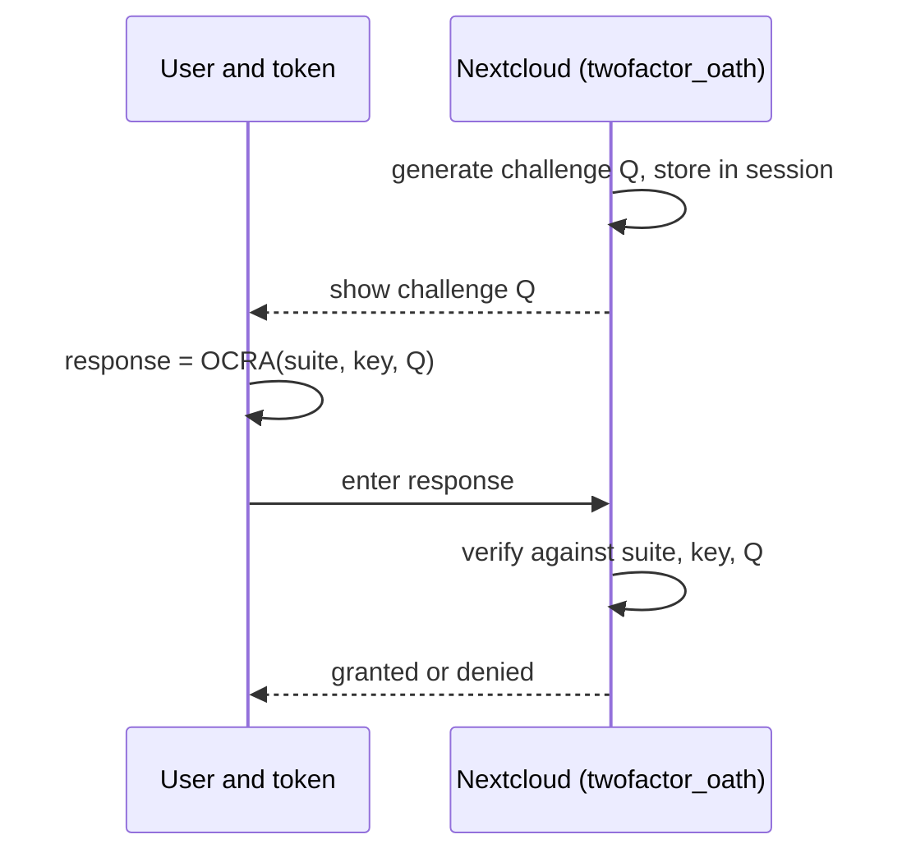
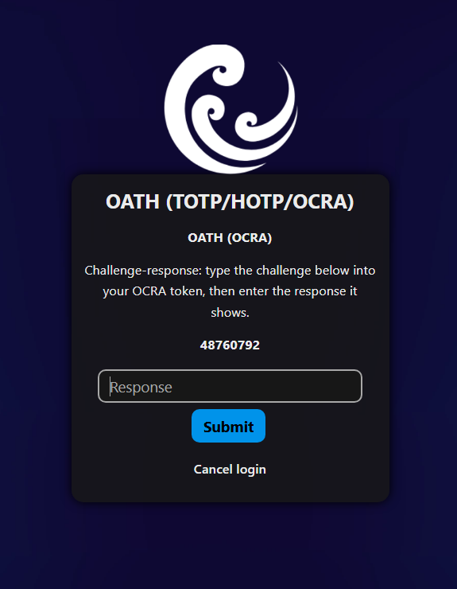

<!--
  SPDX-FileCopyrightText: 2026 [ernolf] Raphael Gradenwitz <raphael.gradenwitz@googlemail.com>
  SPDX-License-Identifier: AGPL-3.0-or-later
-->

# OCRA (challenge-response)

OCRA is the OATH Challenge-Response Algorithm, [RFC 6287](https://www.rfc-editor.org/info/rfc6287/). Instead of a code that changes with time (TOTP) or a counter (HOTP), the server shows a challenge, the token computes a response from that challenge and the shared secret, and the server verifies it. A fresh challenge every time means there is no replay window.

OCRA is built on HMAC and the same dynamic truncation as HOTP. It is not provided by the otphp library, so this app implements it itself (`lib/Service/Ocra.php`), verified against the [RFC 6287 test vectors](https://www.rfc-editor.org/info/rfc6287/#appendix-C).

## The login flow





## Suites

An OCRA token is described by an [OCRASuite string](https://www.rfc-editor.org/info/rfc6287/#section-6), for example `OCRA-1:HOTP-SHA1-6:QN08`:

- `OCRA-1`: the algorithm version (the only one defined by RFC 6287).
- `HOTP-SHA1-6`: HMAC with SHA-1, truncated to a 6-digit response.
- `QN08`: a numeric challenge (`N`) of up to 8 digits.

In this app the suite is composed from the chosen algorithm, digit count and challenge length, and shown read-only so it can be matched against the token device. RFC 6287 defines SHA-1, SHA-256 and SHA-512; the response is 4 to 10 digits and the numeric challenge length is configurable. Strict RFC mode keeps OCRA to SHA-1/256/512.


## Hardware

Any hardware device that follows the OATH OCRA standard works with this app as long as it is provisioned in Strict RFC mode (so the suite stays within RFC 6287). Whatever a device can do beyond that is listed in [compatibility.md](compatibility.md).

## The software OCRA token (for testing)

There is rarely a software OCRA authenticator app, so the repository ships a small command-line token, `tools/ocra_device`, to test challenge-response without hardware. It reuses the app's own OCRA engine, so its output is identical to what the server computes.

```sh
# verify against the RFC 6287 test vectors
php tools/ocra_device --selftest

# compute a response for a secret and a challenge (default suite OCRA-1:HOTP-SHA1-6:QN08)
php tools/ocra_device <secret-base32> <challenge>

# a different suite, given in full or as a shorthand (1-6, 256-8, 512-6, ...)
php tools/ocra_device --suite=256-8 <secret-base32> <challenge>

# store credentials under a name and reuse them by name (or pick from a prompt)
php tools/ocra_device --save=alice <secret-base32> 256-8
php tools/ocra_device --name=alice <challenge>
```

Saved credentials live in `tools/.ocra_rc` (git-ignored, plaintext); it is a developer test tool, not a production secret store.

### Test walkthrough

1. In the personal settings, set up an OCRA token and note the secret and the resulting suite.
2. Save them: `php tools/ocra_device --save=me <secret> <suite-shorthand>`.
3. At setup or login, when a challenge is shown, run `php tools/ocra_device --name=me <challenge>` and enter the response.
