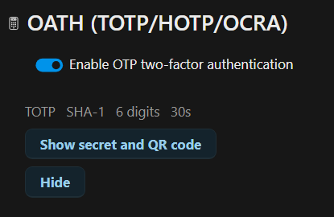
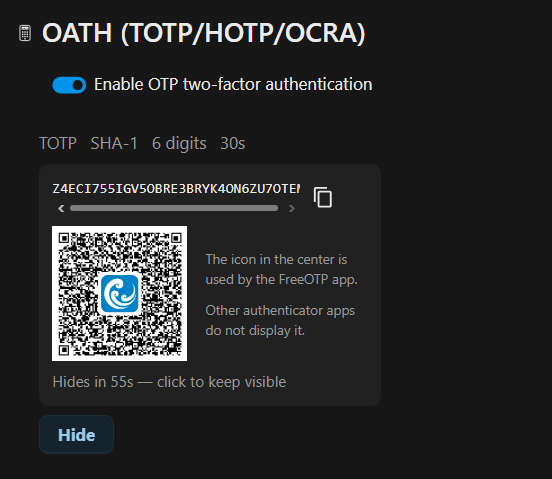

<!--
  SPDX-FileCopyrightText: 2026 [ernolf] Raphael Gradenwitz <raphael.gradenwitz@googlemail.com>
  SPDX-License-Identifier: AGPL-3.0-or-later
-->

# Security model

## Secrets encrypted at rest

Every secret is stored encrypted with `OCP\Security\ICrypto`, the Nextcloud instance encryption (AES-256-GCM, keyed by the instance secret in `config.php`, which lives outside the database). This matches the bundled `twofactor_totp`. The plaintext secret exists only in memory, and only when it is needed: to verify a code, to build a setup QR, or to reveal it on explicit request.

A shared OATH secret is symmetric by design: it has to exist on both the server and the token, and it is transferred to the token as a QR code or by programming the device. The server must be able to compute codes unattended at login, so the secret cannot be protected by a value only the user knows. Encryption at rest is therefore the meaningful protection, and it guards against database dumps, backups and unrelated SQL access.

## Forced password confirmation for sensitive actions

Revealing an existing secret or QR, and disabling the provider, each require a fresh password confirmation on every call. This is deliberate and stronger than the normal Nextcloud password-confirmation grace window (which skips the prompt for about thirty minutes after a recent confirmation):

- Revealing a secret is equivalent to cloning the token, so it must stay a deliberate act even on a logged-in session whose password is saved in the browser.
- Disabling two-factor authentication is security-decreasing, so it must be confirmed rather than toggled away.

Re-displaying an existing secret and its QR is a feature many users asked for (a second device, a device change, no need to reset the token), so it is offered, but under hardened conditions. After a successful reveal, the secret and QR are shown for 60 seconds and then hidden automatically; clicking the panel resets the timer while you are actively working with it. This is the online-banking pattern: it protects against someone scanning the QR while the user is briefly away, and the whole ceremony (a fresh password, then a countdown) reinforces that the secret does not need to stay on screen.

Enabling the provider keeps the normal grace window, since enabling raises security. The forced confirmation uses the official `@nextcloud/password-confirmation` strict mode: the request carries `{ confirmPassword: PwdConfirmationMode.Strict }`, the interceptor shows the standard password dialog every time and sends the password as Basic authentication, and the server-side `#[PasswordConfirmationRequired(strict: true)]` attribute verifies it per request. This is the same mechanism the core two-factor enforcement settings use.

> [!NOTE]
> A reveal or disable dialog cannot protect against a password that the browser auto-fills and the user confirms. That is the user's choice. The dialog ensures the action is never silent.

## Strict RFC mode

The advanced UI offers a Strict RFC compliance switch that greys out options the relevant RFC does not cover. It is a UI guard only; the backend always accepts the full range. This gives an admin safe, interoperable defaults without preventing deliberate, documented deviations (and without breaking already-provisioned or imported tokens). See [compatibility.md](compatibility.md).

## Replay protection

- **TOTP**: the accepted time slice is recorded, so the same code cannot be replayed within its validity window. Clock drift is tolerated with a small leeway below the period.
- **HOTP**: verification advances the stored counter past the matched value and uses a look-ahead window, so a few skipped codes on the token recover automatically.
- **OCRA**: the challenge is generated server-side per attempt and consumed on success, so a response cannot be replayed.

## HOTP resynchronisation

If a counter-based (HOTP) token drifts beyond the look-ahead window, it is re-synchronised with two consecutive codes ([RFC 4226 section 7.4](https://www.rfc-editor.org/info/rfc4226/#section-7.4)): the server searches a wide window for an index where two successive codes match, then advances the counter past both. Requiring two consecutive matches keeps the wide search safe against guessing. Resynchronisation is offered both at the login prompt (so a user is never locked out) and in the personal settings. It does not require a password, because two valid consecutive codes already prove possession of the token.

## Base32 and secret length

OATH secrets are exchanged as Base32 ([RFC 4648](https://www.rfc-editor.org/info/rfc4648/#section-6)). Base32 encodes 5 bits per character, while key material is counted in bytes of 8 bits. Five bytes (40 bits) map exactly to eight characters, so a secret of N bytes encodes to `ceil(8 * N / 5)` characters. Only some character counts correspond to a whole number of bytes; a count whose remainder modulo 8 is 1, 3 or 6 ends on a partial byte and does not represent valid key material.

RFC 4648 does define `=` padding for Base32 (like Base64), but padding only rounds the final group up to eight characters. It does not turn dangling bits into a byte, so a character count that does not map to whole bytes stays invalid with or without padding. OTP and `otpauth://` secrets are by convention used without padding, and authenticators expect a clean byte boundary.

This is why the app does not let you pick an arbitrary character length. The default length is chosen in bytes (the strength presets), generation always produces a whole number of bytes, and a pasted custom secret is validated for a clean byte boundary. The point is both interoperability (the QR imports everywhere) and correctness: a token must carry the full intended key material, never a silently truncated fragment. This is the same strict-by-default stance as the Strict RFC mode.

## Threat model and limitations

OATH one-time passwords raise the bar against stolen, reused or leaked passwords, but they are not a universal answer. The honest limitations:

- **Phishing — and no shared-secret factor resists it.** A one-time password can be typed into a fake site or relayed in real time by a man-in-the-middle proxy. Tools such as [Evilginx](https://github.com/kgretzky/evilginx2) automate this: they auto-provision a valid TLS certificate for a lookalike domain (so the victim sees a normal padlock), forward the login to the real server, and steal the resulting authenticated session. The code is never "broken"; it is simply passed through. This applies to every factor that submits a secret or code — OATH, SMS, email, push approval — not just this app. The only phishing-resistant class is **FIDO2/WebAuthn** (`twofactor_webauthn`), because the authenticator cryptographically signs the actual origin: a lookalike domain cannot obtain a valid assertion, so there is nothing to relay. If phishing resistance is the goal, use FIDO2 — ideally as the *only* enabled factor, since any phishable fallback can be downgraded to. OATH then complements it for users and tokens that cannot use FIDO. See [compatibility.md](compatibility.md).
- **Software token on a compromised device.** Malware on the phone or computer that holds the secret can read it or the generated codes. A hardware token avoids this (see below).
- **Shoulder-surfing and saved passwords.** Revealing a secret is gated by a forced password confirmation and an auto-hiding display, so it is never silent. A browser-saved password that the user confirms is outside the app's control.

Where OATH is still the right tool:

- **It defends against the most common attacks.** A large share of account takeovers stem from stolen, reused or leaked passwords and credential stuffing — untargeted, at scale. Against all of these, any second factor (OATH included) is highly effective. A real-time phishing proxy, by contrast, is a deliberate, higher-effort, targeted attack.
- **It works everywhere.** OATH needs only an authenticator app or a token, with no dependency on a platform authenticator, browser support, or USB/NFC hardware that FIDO can require. For many users and devices it is the strongest factor actually available.
- **Hardware OATH tokens are hard to compromise.** On a dedicated hardware token the secret never leaves the device and cannot be exfiltrated by malware; the only practical attack is physical theft — the same residual risk as a FIDO USB key without a PIN or biometric.
- **OCRA challenge-response.** Among Nextcloud second factors this is offered only by this app, for hardware tokens and challenge-response workflows that TOTP and HOTP do not cover.
- **Trained users close much of the residual gap.** Users who treat an unexpected code prompt, or a "your security key isn't working, use another method" message, as a red flag are far less exposed to the real-time and downgrade tricks above.

What the app actively mitigates:

- **Brute force.** Code verification, enrollment and resynchronisation are rate-limited through Nextcloud's brute-force protection. The password confirmation for reveal and disable is handled by Nextcloud's standard password-confirmation mechanism.
- **Replay.** TOTP time slices and HOTP counters are tracked, and OCRA challenges are single-use (see above).
- **Secrets at rest.** Encrypted with the instance key (see above).

Delivery-based one-time passwords (SMS, email) have their own weaknesses such as SIM swapping and interception. They do not apply here: this app uses OATH tokens (an app or a device), not delivered codes.

## How the second-factor methods compare

Where the methods sit relative to one another on the properties that actually matter for security (not feature count). The last column is the decisive one: it is the only property a real-time phishing proxy cannot defeat.

| Method | Possession factor | No delivery channel | Hardware-isolated secret | Challenge-response | Phishing-resistant |
| --- | :-: | :-: | :-: | :-: | :-: |
| SMS / email code | no (delivered) | no | no | no | no |
| Messenger code (Telegram, Signal, WhatsApp) | no (delivered) | no | no | no | no |
| Push approval (with number matching) | yes | no | partial | no | no |
| **OATH software token (this app)** | yes | yes | no | yes (OCRA) | no |
| **OATH hardware token (this app)** | yes | yes | yes | yes (OCRA) | no |
| WebAuthn / FIDO2 / passkey | yes | yes | yes¹ | yes | **yes** |
| Client certificate / smartcard | yes | yes | yes² | yes | **yes** |

- **Possession factor** versus a *delivered code*: a delivered code proves only access to a channel (a phone number, a mailbox, a chat account), not possession of an enrolled token. The channel itself is an extra attack surface.
- **No delivery channel**: an OATH token computes its codes locally and works offline. There is no SMS, email or chat message to intercept, and no messaging account to take over. This is a concrete advantage of this app over SMS and messenger codes.
- **Messenger codes** carry the weaknesses of both a delivered code *and* the messaging account itself (often secured by an SMS code, so SIM-swappable), which makes them typically weaker than an authenticator app, not stronger.
- **Number matching or a shown login location** on push is a detection aid for an attentive user, not cryptographic resistance: a real-time proxy still triggers the genuine prompt, which the user then approves.
- ¹ Device-bound and roaming FIDO keys keep the private key on the authenticator. **Synced passkeys** replicate it (encrypted) across the user's platform cloud, so it is not strictly device-bound, but it is still never exposed to the site or its JavaScript and remains origin-checked.
- ² On a smartcard the key is isolated in hardware; a software client certificate is only as isolated as the host key store.

Only the last two methods are phishing-resistant, because the authentication is bound to the real origin (WebAuthn) or TLS channel (client certificate) by the browser, which the phishing proxy cannot forge. Every code-based method, this app included, can be relayed by a real-time proxy (see the threat model above). The honest reading is a ladder: delivered codes (SMS, messenger) are the weakest rung; a software OATH token is markedly stronger and works offline; a hardware OATH token adds secret isolation; and only origin- or channel-bound credentials reach phishing resistance.

## Recommendation

Keep Nextcloud backup codes enabled alongside OATH, so a user who loses the token can still recover. For admin-managed accounts, the administrator can re-provision a lost token.
